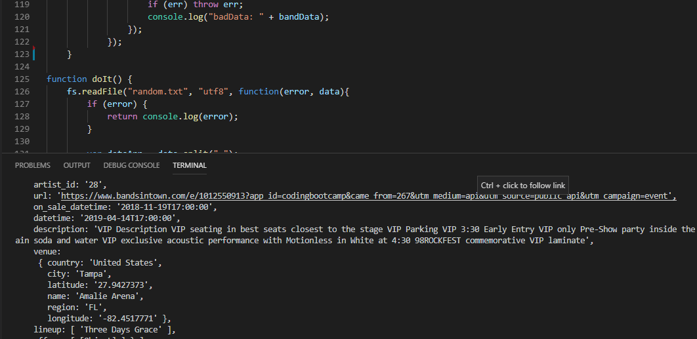
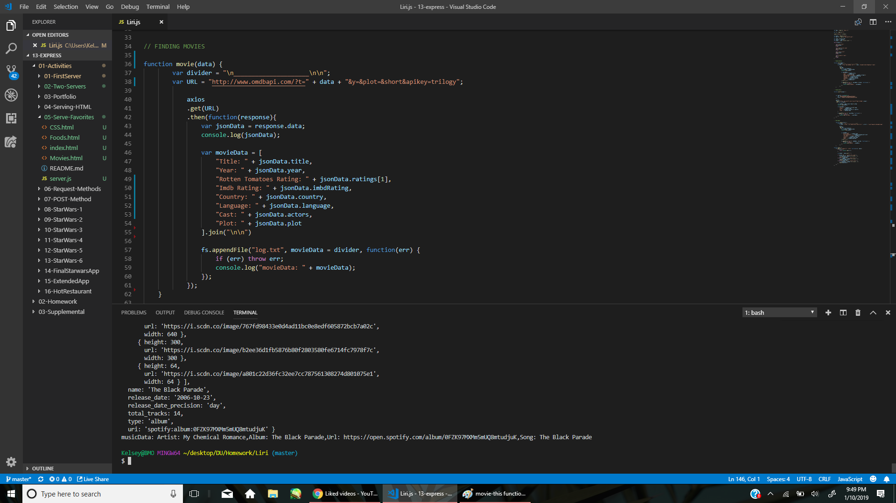
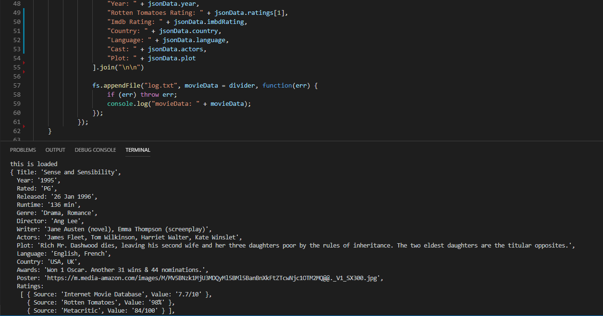
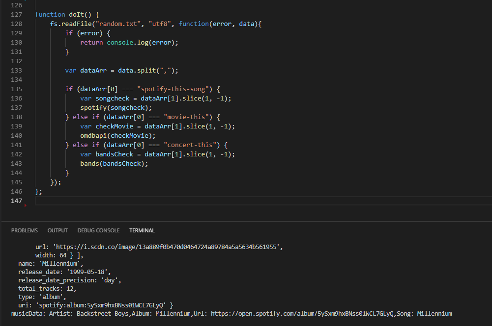

# Liri

LIRI will be a command line node app that takes in parameters and gives you back data. 
To get Liri to work type in either music-this, 

spotify-this-song,

movie-this,

or do-what-it-says.

Tech Used: 

Javascript and node

